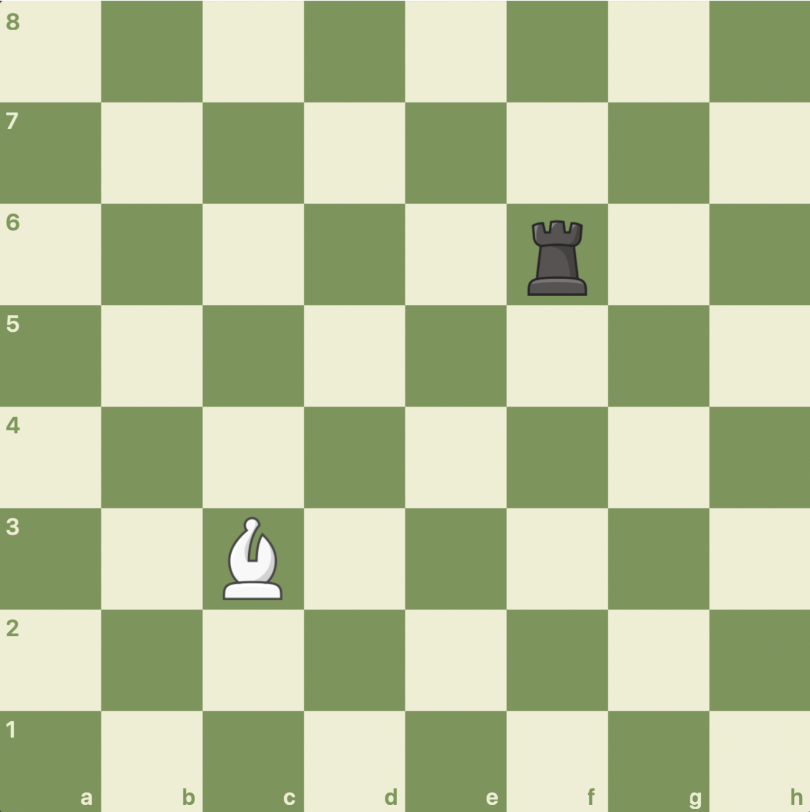

# Rook vs Bishop

A Spring Boot Command Line Application which runs through a single game of Rook Vs Bishop or one of its variants.

## Game Explanation

- Rook Vs Bishop: The white bishop remains on square c3 throughout the entirety of the game, and the black rook tries to
  survive 15 turns without landing in the white bishop's line of fire. If the rook survives 15 rounds or lands on square
  c3, then he wins; otherwise the white bishop wins. Each of the rook's moves are determined by the flipping of a coin
  and sum of numbers on two rolled die.
- Rook Vs Liberated Bishop: Similar to the above game, but now the bishop moves as well, and a piece can only win if it
  lands on the square of another piece. If no one wins in 10 moves it is a stalemate.

## What you need

- Gradle
- JRE

## Instructions

First build the jar file:

`./gradlew build`

Then run the jar file, also passing in an argument for which game to play (`Rook Vs Bishop` or `Rook Vs Liberated Bishop`):

`java -jar build/libs/rookvbishop-0.0.1-SNAPSHOT.jar Rook Vs Liberated Bishop`

The program automatically runs through the entire game, and you can read through the results that have been printed on
the console.

## Timeline of Development

- First implemented Rook Vs Bishop
- Added second iteration Rook Vs Liberated Bishop:
  - Command line arguments
  - Describe bishop movement
  - Refactored classes accordingly
  - Tests

## Future Enhancements

- Visualise the board after each move in the console or create a front end
- Develop it into a game which involves strategy and not just change:
  - Make the game two pieces vs. two pieces, then three etc.
  - Players can move either with command line arguments (i.e. type in Rook - a5) or clicking on a frontend
  - Add other chess pieces
- Scalable as a Web Application
  - Add Players class to allow players to keep track of their games and play others
  - Add database to keep track of player and game histories